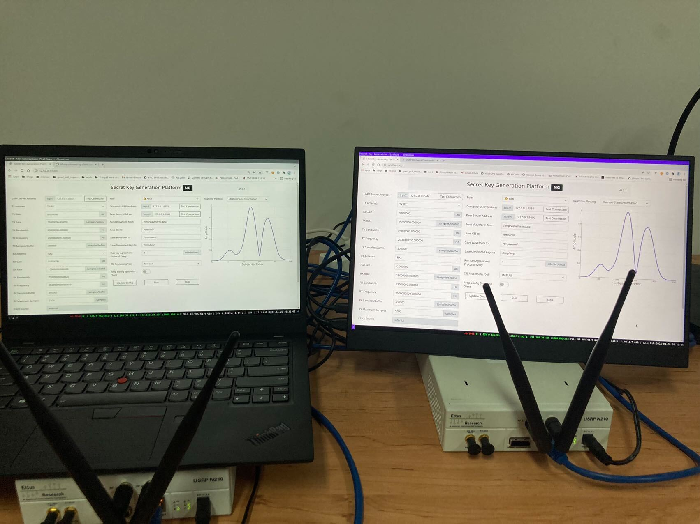

## skg-client

A Secret Key Generation Platform.

### 如何运行

1. 编译 usrp_server (Ubuntu 20.04 为例)

```bash
sudo add-apt-repository ppa:ettusresearch/uhd
sudo apt-get update
sudo apt-get install libboost-all-dev libzmq3-dev fftw3-dev rapidjson-dev \
                     libuhd-dev libuhd3.15.0 uhd-host

git clone https://github.com/oh-my-physec/usrp-server.git
cd usrp-server
mkdir build
cd build
cmake ..
make -j8
```

得到 `usrp_server` 程序

2. 运行 usrp_server

```bash
## USRP 地址为 192.168.10.2 并将 ZeroMQ 绑定到 5555 端口
./usrp_server --bind "tcp://*:5555" --device-args "addr=192.168.10.2"
```

3. 运行 skg_client

```bash
git clone https://github.com/oh-my-physec/skg-client.git
cd skg-client
python3 -m venv venv
source venv/bin/activate
pip install -r requirements.txt
FLASK_APP=main.py flask run --port=5000
```

4. 本平台中主要使用 m 序列获取 LTI 系统的冲击响应. 使用 MATLAB 生成 4095 点的 m 序列.

```matlab
data = mls(4095) * 2;
write_complex_binary(data, '/tmp/waveform.data');
```

### 截图


